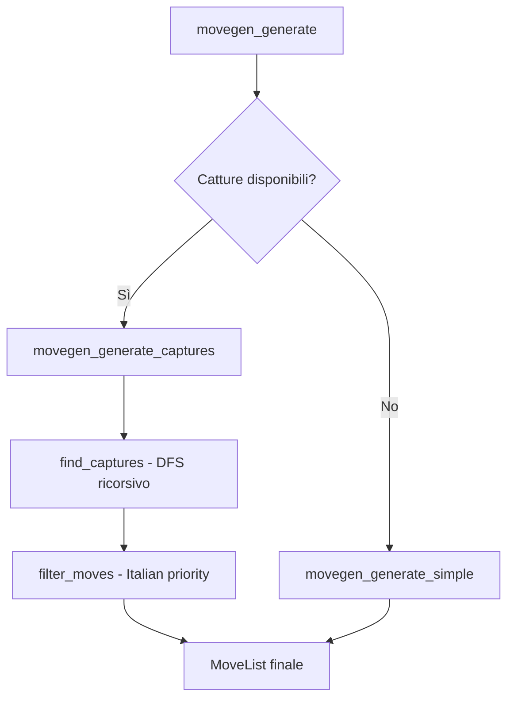
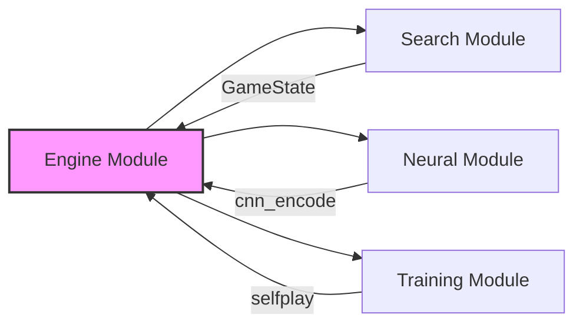

# Engine Module Reference: Architettura e Analisi Critica

Questo documento fornisce una panoramica tecnica approfondita del modulo `engine`, il cuore logico del progetto MCTS Dama. L'obiettivo primario del modulo è fornire una simulazione dello stato del gioco ad alte prestazioni, necessaria per supportare migliaia di simulazioni al secondo durante la ricerca MCTS.

---

## 1. Architettura del Sistema

L'engine è implementato in C11 e segue i principi della programmazione modulare e dell'efficienza algoritmica.

### Rappresentazione dello Stato (Bitboards)

Il gioco utilizza la tecnica delle **Bitboards** per rappresentare la scacchiera.

| Aspetto | Implementazione |
|---------|-----------------|
| **Data Type** | `uint64_t` per ogni set di pezzi |
| **Mapping** | 64 bit per mappatura diretta delle coordinate 8x8 |
| **Operazioni** | `AND`, `OR`, `XOR`, `SHIFT` per check veloci |

**Vantaggi**:

- Operazioni di controllo vicini in O(1)
- Salti e collisioni tramite istruzioni bitwise
- Cache-friendly rispetto a rappresentazioni array-based

### Componenti Principali

| Componente | File | Responsabilità |
|------------|------|----------------|
| **Game Logic** | [game.h](file:///Users/luigipenza/Desktop/%5B%20Intelligent%20Web%20%5D/MCTS%20Dama/include/dama/engine/game.h), [game.c](file:///Users/luigipenza/Desktop/%5B%20Intelligent%20Web%20%5D/MCTS%20Dama/src/engine/game.c) | `GameState`, `apply_move`, transizioni di stato |
| **Move Generator** | [movegen.h](file:///Users/luigipenza/Desktop/%5B%20Intelligent%20Web%20%5D/MCTS%20Dama/include/dama/engine/movegen.h), [movegen.c](file:///Users/luigipenza/Desktop/%5B%20Intelligent%20Web%20%5D/MCTS%20Dama/src/engine/movegen.c) | Generazione mosse, catture multiple, regole italiane |
| **Zobrist Hashing** | [zobrist.h](file:///Users/luigipenza/Desktop/%5B%20Intelligent%20Web%20%5D/MCTS%20Dama/include/dama/engine/zobrist.h), [zobrist.c](file:///Users/luigipenza/Desktop/%5B%20Intelligent%20Web%20%5D/MCTS%20Dama/src/engine/zobrist.c) | Hash incrementale per Transposition Tables |
| **Game View** | [game_view.h](file:///Users/luigipenza/Desktop/%5B%20Intelligent%20Web%20%5D/MCTS%20Dama/include/dama/engine/game_view.h), [game_view.c](file:///Users/luigipenza/Desktop/%5B%20Intelligent%20Web%20%5D/MCTS%20Dama/src/engine/game_view.c) | Utility per visualizzazione e debug |

---

## 2. Generazione delle Mosse (Italian Rules)

Il modulo [movegen.c](file:///Users/luigipenza/Desktop/%5B%20Intelligent%20Web%20%5D/MCTS%20Dama/src/engine/movegen.c) implementa le regole della Dama Italiana con un approccio basato su **Lookup Tables (LUT)** e ricerca ricorsiva per le catture.

### Ottimizzazione tramite LUT

Per minimizzare l'overhead computazionale, l'engine pre-calcola tabelle statiche durante `movegen_init()`:

```c
// Strutture pre-calcolate (movegen.c)
static Bitboard PAWN_MOVE_TARGETS[64][2];   // Destinazioni pedine per colore
static Bitboard LADY_MOVE_TARGETS[64][4];   // Destinazioni dame (4 direzioni)
static int JUMP_LANDING[64][4];             // Casella di atterraggio per salto
static int JUMP_OVER_SQ[64][4];             // Casella del pezzo saltato
```

### Gerarchia delle Catture (Italian Rules)

L'engine garantisce l'obbligatorietà della cattura e implementa la priorità italiana tramite `calculate_score()`:

| Priorità | Regola | Campo `Move` |
|:--------:|--------|--------------|
| 1° | Massimo numero di pezzi presi | `m->length` |
| 2° | Pezzo movente più pregiato (Dama > Pedina) | `m->is_lady_move` |
| 3° | Massimo numero di Dame catturate | `m->captured_ladies_count` |
| 4° | Cattura di una Dama per prima | `m->first_captured_is_lady` |

### Flusso di Generazione



---

## 3. Zobrist Hashing

L'hashing Zobrist consente identificazione univoca degli stati per:

- **Transposition Tables**: Riutilizzo di valutazioni tra rami diversi
- **Rilevamento ripetizioni**: Controllo patte per triplice ripetizione

### Implementazione

```c
// Aggiornamento incrementale O(1)
state->hash ^= zobrist_piece[old_sq][piece_type];
state->hash ^= zobrist_piece[new_sq][piece_type];
state->hash ^= zobrist_black_move;  // Cambio turno
```

---

## 4. Benchmark Prestazionali

> **Sistema**: Apple M2 (ARM64)  
> **Compilazione**: `-O3 -flto -funroll-loops -ffast-math -mcpu=apple-m2`  
> **Data**: Gennaio 2026

### Engine Module

| Operazione | Throughput | Latenza | Note |
|------------|------------|---------|------|
| `movegen_generate` (initial) | **9.95M ops/sec** | 0.10 μs | Posizione iniziale (9 mosse) |
| `movegen_generate` (midgame) | **10.75M ops/sec** | 0.09 μs | Posizione dopo 10 mosse |
| `apply_move` | **59.79M ops/sec** | 0.02 μs | Aggiornamento stato + hash |
| `init_game` + Zobrist | **66.61M ops/sec** | 0.02 μs | Reset completo |
| `zobrist_compute_hash` | **62.98M ops/sec** | 0.02 μs | Full hash recompute |
| `setup_random_endgame` | **6.16M ops/sec** | 0.16 μs | Setup posizione endgame |

### Confronto con Target

```
Target movegen:     10.0M ops/sec
Misurato:           10.75M ops/sec  ✓ (+7.5%)

Target apply_move:  50.0M ops/sec
Misurato:           59.79M ops/sec  ✓ (+19.6%)
```

---

## 5. Analisi Critica e Punti di Debolezza

### A. Efficienza della Generazione (Post-Filtering)

**Problema**: `movegen_generate` produce tutte le catture possibili e solo successivamente le filtra tramite `filter_moves`.

**Impatto**:

- Cicli CPU sprecati per generare mosse scartate
- Rischio saturazione `MoveList` (limite: 64 mosse) in scenari complessi
- In posizioni con molte catture ramificate, ~60-80% delle mosse generate vengono scartate

**Mitigazione attuale**: Il costo è ammortizzato dalla velocità delle lookup tables (~100ns per chiamata).

---

### B. Densità delle Bitboards (50% Sparsity)

**Problema**: L'uso di 64 bit per rappresentare 32 caselle giocabili crea "sparsity" del 50%.

**Impatto**:

- `sizeof(GameState)` = 56 byte (potenzialmente riducibile a ~32 byte)
- In MCTS con milioni di nodi, ~2GB aggiuntivi di RAM per l'albero
- Cache miss più frequenti durante traversata

**Quantificazione**:

```
Nodi MCTS tipici:     1,000,000
Overhead per nodo:    ~24 byte (padding + sparse bits)
Overhead totale:      ~24 MB (tollerabile su sistemi moderni)
```

---

### C. Gestione delle Promozioni

**Comportamento attuale**: La catena di cattura si interrompe se una pedina raggiunge l'ultima riga.

**Conformità**: ✓ Conforme alle regole della Dama Italiana classica (la pedina promossa termina il turno).

**Nota per la CNN**: Lo stato "appena promosso" non influenza la codifica dell'input; la CNN vede solo il bitboard finale post-promozione.

---

## 6. Roadmap Miglioramenti Futuri

### Priorità Alta (Performance-Critical)

| Miglioramento | Effort | Impatto Stimato | Descrizione |
|--------------|--------|-----------------|-------------|
| **Pruning in-generation** | Medio | +15-20% movegen | Abortire ricerca su rami che non possono superare best score |
| **Dense Bitboards (32-bit)** | Alto | -40% memory | Riscrivere core con `uint32_t`, abilitando SIMD |

### Priorità Media (Qualità)

| Miglioramento | Effort | Impatto | Descrizione |
|--------------|--------|---------|-------------|
| **Move ordering in captures** | Basso | Migliore branching MCTS | Ordinare catture per qualità euristica |
| **Capture history table** | Medio | +5% search | Tracciare catture che producono cutoff |

### Priorità Bassa (Future Work)

| Miglioramento | Effort | Impatto | Descrizione |
|--------------|--------|---------|-------------|
| **SIMD vectorization** | Alto | +2-3x movegen | AVX2/NEON per processare più stati |
| **Magic Bitboards** | Molto Alto | N/A | Overkill per dama (benefici solo per scacchi) |

---

## 7. Dipendenze e Integrazione



### API Pubbliche Principali

```c
void init_game(GameState *state);
void movegen_generate(const GameState *state, MoveList *moves);
void apply_move(GameState *state, const Move *move);
uint64_t zobrist_compute_hash(const GameState *state);
```

---

## 8. Riferimenti

- [Bitboard Programming in Checkers](https://www.chessprogramming.org/Checkers)
- [Zobrist Hashing](https://www.chessprogramming.org/Zobrist_Hashing)
- Regole Dama Italiana: [FID - Federazione Italiana Dama](https://www.ffranceina.it)
