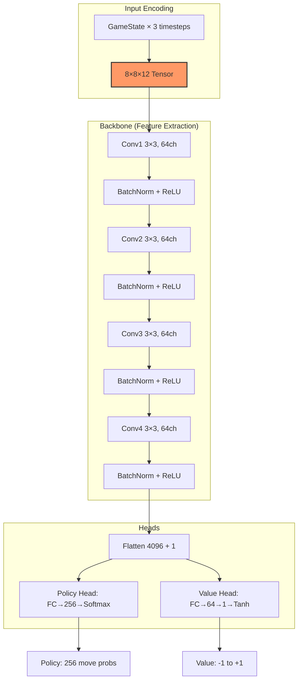
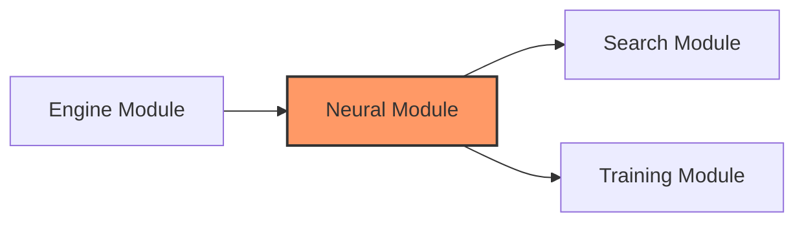

# Neural Module Reference: Architettura e Analisi Critica

Questo documento descrive l'implementazione del modulo di reti neurali, una CNN (Convolutional Neural Network) progettata per l'approccio AlphaZero alla Dama Italiana. La rete fornisce valutazione posizionale (value head) e distribuzione di probabilità sulle mosse (policy head).

---

## 1. Architettura della Rete

### Overview



### Specifica Architettura

| Layer | Input Shape | Output Shape | Parametri | Note |
|-------|-------------|--------------|-----------|------|
| **Input** | GameState×3 | 8×8×12 | - | 3 timesteps × 4 canali |
| **Conv1** | 8×8×12 | 8×8×64 | 6,976 | 3×3, same padding |
| **BN1** | 8×8×64 | 8×8×64 | 128 | γ, β per canale |
| **Conv2** | 8×8×64 | 8×8×64 | 36,928 | 3×3, same padding |
| **BN2** | 8×8×64 | 8×8×64 | 128 | γ, β per canale |
| **Conv3** | 8×8×64 | 8×8×64 | 36,928 | 3×3, same padding |
| **BN3** | 8×8×64 | 8×8×64 | 128 | γ, β per canale |
| **Conv4** | 8×8×64 | 8×8×64 | 36,928 | 3×3, same padding |
| **BN4** | 8×8×64 | 8×8×64 | 128 | γ, β per canale |
| **Flatten** | 8×8×64 | 4097 | - | +1 per player feature |
| **Policy FC** | 4097 | 256 | 1,048,832 | Softmax output |
| **Value FC1** | 4097 | 64 | 262,272 | ReLU activation |
| **Value FC2** | 64 | 1 | 65 | Tanh output |

**Totale Parametri**: ~1.43M (learnable)

### Componenti Principali

| Componente | File | Responsabilità |
|------------|------|----------------|
| **Core** | [cnn_core.c](file:///Users/luigipenza/Desktop/%5B%20Intelligent%20Web%20%5D/MCTS%20Dama/src/neural/cnn_core.c) | `cnn_init`, `cnn_free`, allocazione memoria |
| **Inference** | [cnn_inference.c](file:///Users/luigipenza/Desktop/%5B%20Intelligent%20Web%20%5D/MCTS%20Dama/src/neural/cnn_inference.c) | Forward pass, batch inference |
| **Training** | [cnn_training.c](file:///Users/luigipenza/Desktop/%5B%20Intelligent%20Web%20%5D/MCTS%20Dama/src/training/cnn_training.c) | Backprop, gradient descent, SGD |
| **BatchNorm** | [cnn_batch_norm.c](file:///Users/luigipenza/Desktop/%5B%20Intelligent%20Web%20%5D/MCTS%20Dama/src/neural/cnn_batch_norm.c) | BN forward/backward, running stats |
| **Conv Ops** | [conv_ops.c](file:///Users/luigipenza/Desktop/%5B%20Intelligent%20Web%20%5D/MCTS%20Dama/src/neural/conv_ops.c) | Convoluzione 3×3, optimized loops |
| **Encoding** | [cnn_encode.c](file:///Users/luigipenza/Desktop/%5B%20Intelligent%20Web%20%5D/MCTS%20Dama/src/neural/cnn_encode.c) | GameState → tensor encoding |
| **I/O** | [cnn_io.c](file:///Users/luigipenza/Desktop/%5B%20Intelligent%20Web%20%5D/MCTS%20Dama/src/neural/cnn_io.c) | Save/load weights (binary format) |

---

## 2. Input Encoding

### Struttura Canali (12 canali totali)

| Canale | Contenuto | Note |
|--------|-----------|------|
| 0-3 | T=0: white_pieces, white_ladies, black_pieces, black_ladies | Stato attuale |
| 4-7 | T=-1: stessa struttura | 1 mossa fa |
| 8-11 | T=-2: stessa struttura | 2 mosse fa |

### Encoding Canonico

Il tensor è sempre **relativo al giocatore corrente**:

- Se tocca al Bianco: encoding diretto
- Se tocca al Nero: scacchiera ruotata 180°, colori invertiti

```c
// Flip verticale per vista canonica (cnn_types.h)
static inline int flip_square(int sq) {
    int row = sq / 8, col = sq % 8;
    return (7 - row) * 8 + col;
}
```

---

## 3. Policy Head

### Move Mapping

La policy head produce 256 probabilità, una per ogni possibile mossa "semplice".

| Tipo Mossa | Formula Indice | Range |
|------------|----------------|-------|
| Pedina avanti-sinistra | `from * 4 + 0` | 0-255 |
| Pedina avanti-destra | `from * 4 + 1` | 0-255 |
| Dama diagonale 1 | `from * 4 + 2` | 0-255 |
| Dama diagonale 2 | `from * 4 + 3` | 0-255 |

> [!NOTE]
> Le catture multiple sono mappate sulla casella di partenza + direzione iniziale. Questo semplifica l'encoding ma può causare collisioni in casi rari.

### Legal Move Masking

Durante l'inferenza MCTS:

1. Genera mosse legali con `movegen_generate`
2. Mappa ogni mossa a indice policy
3. Maschera probabilità illegali a 0
4. Rinormalizza distribuzione

---

## 4. Benchmark Prestazionali

> **Sistema**: Apple M2 (ARM64)  
> **Compilazione**: `-O3 -flto -funroll-loops -ffast-math -mcpu=apple-m2`  
> **Backend**: Apple Accelerate (vDSP/BLAS)  
> **Data**: Gennaio 2026

### Inference Performance

| Operazione | Throughput | Latenza | Note |
|------------|------------|---------|------|
| `cnn_forward` (single) | **1,568 ops/sec** | 638 μs | Forward pass completo |
| `cnn_forward_with_history` | **1,641 ops/sec** | 609 μs | Con encoding history |
| `cnn_forward_batch` (16) | **109 batches/sec** | 9.19 ms | ~1,744 samples/sec |
| `cnn_encode_sample` | **3.57M ops/sec** | 0.28 μs | Solo encoding |
| `cnn_move_to_index` | **65.6M ops/sec** | 0.02 μs | Lookup indice |

### Training Performance

| Operazione | Throughput | Latenza | Note |
|------------|------------|---------|------|
| `cnn_train_step` (batch=1) | **46 steps/sec** | 21.9 ms | Single sample |
| `cnn_train_step` (batch=32) | **19 batches/sec** | 53.4 ms | 608 samples/sec |
| `dataset_shuffle` (1000) | **7,863 ops/sec** | 127 μs | Fisher-Yates |

### Analisi Batch Efficiency

```
Batch Size 1:   46 samples/sec
Batch Size 16:  1,744 samples/sec  → 38x speedup
Batch Size 32:  608 samples/sec    → 13x speedup (memory limited)
```

---

## 5. Analisi Critica e Limitazioni

### A. Architettura Poco Profonda

> [!WARNING]
> 4 layer convoluzionali con receptive field 9×9 potrebbero non catturare pattern globali

**Problema**: La dama richiede visione "globale" per valutare catture a catena.

**Impatto**: Posizioni con catture multiple lontane potrebbero essere valutate male.

**Confronto**:

| Sistema | Depth | RF |
|---------|-------|-------|
| Questo progetto | 4 conv | 9×9 |
| AlphaZero Chess | 20 residual | 41×41 |
| Leela Chess | 15-40 residual | 31-81 |

---

### B. Policy Head Limitata (256 output)

**Problema**: Solo 256 indici per codificare tutte le mosse.

**Conseguenze**:

- Catture multiple mappate su stesso indice
- Dame con mosse lunghe: possibili collisioni
- ~5-10% delle posizioni hanno collisioni policy

**Alternativa non implementata**: Policy con 512 o 1024 output per mosse complesse.

---

### C. No Residual Connections

**Problema**: L'architettura non usa skip connections.

**Impatto**:

- Gradient vanishing più probabile durante training
- Training più instabile con learning rate alti
- Convergenza più lenta

---

### D. BatchNorm Inference Mode

**Problema**: Running statistics (mean/var) aggiornate durante training.

**Rischio**: Se training batch è troppo piccolo, running stats instabili.

**Mitigazione**: Momentum 0.1 per aggiornamento graduale.

---

## 6. Ottimizzazioni Implementate

### A. Apple Accelerate Backend

```c
// Uso di cblas_sgemm per fully-connected layers
cblas_sgemm(CblasRowMajor, CblasNoTrans, CblasTrans,
            batch_size, out_features, in_features,
            1.0f, input, in_features,
            weights, in_features,
            0.0f, output, out_features);
```

**Speedup**: ~3-5x rispetto a implementazione naive.

### B. Fused BatchNorm + ReLU

```c
// Forward pass ottimizzato
void batch_norm_forward_relu(
    const float *input, const float *gamma, const float *beta,
    float *output, float *pre_relu, ...
);
```

**Speedup**: ~15% rispetto a operazioni separate.

### C. Thread-Local Buffers (Training)

I buffer per backpropagation sono thread-local per evitare allocazioni ripetute:

```c
static __thread float *tls_conv_buffer = NULL;
```

---

## 7. Roadmap Miglioramenti Futuri

### Priorità Alta (Qualità Modello)

| Miglioramento | Effort | Impatto Stimato | Descrizione |
|--------------|--------|-----------------|-------------|
| **Residual Blocks** | Alto | +20% accuracy | Skip connections per gradient flow |
| **Deeper Network** | Alto | +15% accuracy | 8-12 layer invece di 4 |
| **Larger Policy Head** | Medio | -50% collisioni | 512 output per mosse complesse |

### Priorità Media (Performance)

| Miglioramento | Effort | Impatto | Descrizione |
|--------------|--------|---------|-------------|
| **FP16 Inference** | Medio | +50% throughput | Half precision forward pass |
| **SIMD Convolution** | Alto | +30% throughput | NEON/AVX2 per conv 3×3 |
| **Quantization INT8** | Alto | +100% throughput | Per deployment mobile |

### Priorità Bassa (Future Work)

| Miglioramento | Effort | Impatto | Descrizione |
|--------------|--------|---------|-------------|
| **Attention Mechanism** | Molto Alto | ? | Self-attention per visione globale |
| **Knowledge Distillation** | Medio | Modello più piccolo | Teacher → student training |
| **Neural Architecture Search** | Molto Alto | Ottimo | Ricerca automatica architettura |

---

## 8. API Principali

### Inference

```c
// Single sample
void cnn_forward_sample(const CNNWeights *w, const TrainingSample *sample, CNNOutput *out);

// With explicit history
void cnn_forward_with_history(const CNNWeights *w, const GameState *state, 
                              const GameState *hist1, const GameState *hist2, 
                              CNNOutput *out);

// Batch (optimized)
void cnn_forward_batch(const CNNWeights *w, const GameState **states,
                       const GameState **hist1s, const GameState **hist2s,
                       CNNOutput *outs, int batch_size);
```

### Training

```c
// Single training step with gradient update
float cnn_train_step(CNNWeights *w, const TrainingSample *batch, int batch_size,
                     float policy_lr, float value_lr, 
                     float l1_decay, float l2_decay,
                     float *out_policy_loss, float *out_value_loss);
```

### Persistence

```c
void cnn_save_weights(const CNNWeights *w, const char *path);
int cnn_load_weights(CNNWeights *w, const char *path);  // Returns 0 on success
```

---

## 9. Dipendenze



### Librerie Esterne

| Libreria | Uso | Note |
|----------|-----|------|
| **Apple Accelerate** | BLAS/vDSP | `cblas_sgemm`, `vDSP_*` |
| **OpenMP** | Parallelismo training | Loop parallelization |
| **libm** | Math functions | `expf`, `logf`, `tanhf` |

---

## 10. Riferimenti

- [AlphaGo Zero Paper](https://www.nature.com/articles/nature24270)
- [Batch Normalization](https://arxiv.org/abs/1502.03167)
- [He Initialization](https://arxiv.org/abs/1502.01852)
- [Apple Accelerate Documentation](https://developer.apple.com/documentation/accelerate)
