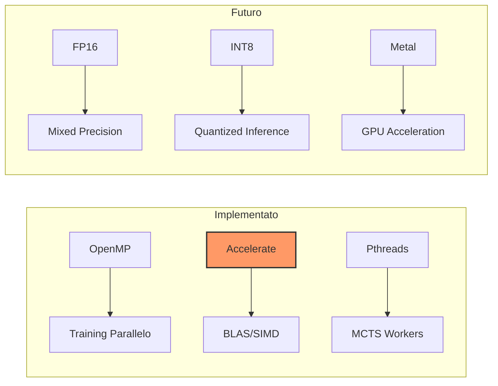

# Optimizations Reference: Parallelismo e Quantizzazione

Questo documento descrive le tecniche di ottimizzazione implementate e pianificate per massimizzare le prestazioni del progetto MCTS Dama su Apple Silicon.

---

## 1. Panoramica Ottimizzazioni



---

## 2. Parallelismo Implementato

### CNN (Neural Network)

| Componente | Tecnica | Descrizione | File |
|------------|---------|-------------|------|
| **Training Loop** | `OpenMP` | Parallelizzazione data-parallel sui batch | [cnn_training.c](file:///Users/luigipenza/Desktop/%5B%20Intelligent%20Web%20%5D/MCTS%20Dama/src/training/cnn_training.c) |
| **Validation** | `OpenMP Redux` | Calcolo parallelo loss con reduction | [training_pipeline.c](file:///Users/luigipenza/Desktop/%5B%20Intelligent%20Web%20%5D/MCTS%20Dama/src/training/training_pipeline.c) |
| **Convoluzioni** | `Accelerate` | `cblas_sgemm` per matrix-matrix multiply | [conv_ops.c](file:///Users/luigipenza/Desktop/%5B%20Intelligent%20Web%20%5D/MCTS%20Dama/src/neural/conv_ops.c) |
| **Fully Connected** | `Accelerate` | `cblas_sgemv` forward, `cblas_sger` backward | [cnn_training.c](file:///Users/luigipenza/Desktop/%5B%20Intelligent%20Web%20%5D/MCTS%20Dama/src/training/cnn_training.c) |
| **Softmax** | `vDSP` | Vettorizzazione SIMD (`vvexpf`, `vDSP_sve`) | [cnn_inference.c](file:///Users/luigipenza/Desktop/%5B%20Intelligent%20Web%20%5D/MCTS%20Dama/src/neural/cnn_inference.c) |
| **Batch Norm** | `OpenMP` | Parallelismo sui canali | [cnn_batch_norm.c](file:///Users/luigipenza/Desktop/%5B%20Intelligent%20Web%20%5D/MCTS%20Dama/src/neural/cnn_batch_norm.c) |

### MCTS & Tournament

| Componente | Tecnica | Descrizione | File |
|------------|---------|-------------|------|
| **Async Batching** | `Pthreads` | Worker accodano richieste in `InferenceQueue`, Master processa batch | [mcts_worker.c](file:///Users/luigipenza/Desktop/%5B%20Intelligent%20Web%20%5D/MCTS%20Dama/src/search/mcts_worker.c) |
| **Thread Safety** | `Mutex/Cond` | Protezione sezioni critiche albero e coda | [mcts_tree.c](file:///Users/luigipenza/Desktop/%5B%20Intelligent%20Web%20%5D/MCTS%20Dama/src/search/mcts_tree.c) |
| **Virtual Loss** | `Atomics` | Penalizza nodi in esplorazione per diversificazione | [mcts_selection.c](file:///Users/luigipenza/Desktop/%5B%20Intelligent%20Web%20%5D/MCTS%20Dama/src/search/mcts_selection.c) |
| **Tournament** | `OpenMP` | Partite giocate in parallelo (`#pragma omp parallel for`) | [tournament.c](file:///Users/luigipenza/Desktop/%5B%20Intelligent%20Web%20%5D/MCTS%20Dama/src/tournament/tournament.c) |

---

## 3. Pipeline FP16/INT8 (Non Implementata)

### Overview

```
┌─────────────────┐    ┌─────────────────┐    ┌─────────────────┐
│  FP16 Training  │ →  │   Calibration   │ →  │  INT8 Inference │
│   (2x speedup)  │    │  (100 samples)  │    │   (3.5x speed)  │
└─────────────────┘    └─────────────────┘    └─────────────────┘
```

### Fase 1: Training Mixed Precision (FP16)

**Modifiche richieste**:

```c
typedef struct {
    _Float16 *conv1_weights;    // Era float*
    float *master_weights;      // FP32 per accumulo gradienti
} CNNWeightsFP16;
```

**Loss Scaling** (previene underflow):

```c
#define LOSS_SCALE 1024.0f
float scaled_loss = loss * LOSS_SCALE;
// backward...
gradients[i] /= LOSS_SCALE;
```

| Metrica | FP32 | FP16 |
|---------|------|------|
| Training Speed | 1x | **1.8-2x** |
| Memory Bandwidth | 100% | 50% |

### Fase 2: Quantizzazione INT8

**Calibrazione**:

```c
void calibrate(model, samples, n) {
    // Raccogli min/max attivazioni per layer
    scale = 127.0f / max(abs(min), abs(max));
}
```

**Inference INT8**:

```c
int8x16_t va = vld1q_s8(input);
int8x16_t vw = vld1q_s8(weights);
acc = vaddvq_s32(vmull_s8(va, vw));  // ARM NEON
```

| Metrica | FP16 | INT8 |
|---------|------|------|
| Inference Speed | 2x | **3.5x** |
| Memoria Pesi | 50% | 25% |

### Effort Stimato

| Fase | Ore |
|------|-----|
| FP16 Training | 8-12h |
| Calibrazione + Quantization | 4-6h |
| Integrazione MCTS | 2-4h |
| Testing | 4-8h |
| **Totale** | **18-30h** |

---

## 4. Ottimizzazioni Engine (Non Implementate)

### A. SIMD NEON per Bitboard

```c
#include <arm_neon.h>

// Processa 2 bitboard contemporaneamente
uint64x2_t pieces = vld1q_u64(&state->white_pieces);
uint64x2_t left = vshrq_n_u64(pieces, 4);
uint64x2_t moves = vorrq_u64(left, right);
```

**Speedup stimato**: 10-20%

### B. Magic Bitboards

Lookup O(1) per attacchi dame lungo diagonali:

```c
uint64_t king_attacks(int sq, uint64_t occupied) {
    MagicEntry *m = &king_magic[sq];
    uint64_t idx = ((occupied & m->mask) * m->magic) >> m->shift;
    return m->attacks[idx];
}
```

**Speedup stimato**: 30-40%
**Complessità**: ⚠️ ALTA - Richiede generazione magic numbers

### C. Incremental Move Update

Invece di rigenerare tutte le mosse, aggiorna solo quelle affette:

```c
void incremental_apply_move(state, move) {
    invalidate_moves_from(from);
    invalidate_moves_from(to);
    regenerate_moves_for_adjacent(from, to);
}
```

**Speedup stimato**: 2-3x in endgame

---

## 5. Priorità Implementazione

| Ottimizzazione | Speedup | Effort | Priorità |
|----------------|---------|--------|----------|
| **FP16 Training** | +80% | Medio | 🥇 1 |
| **INT8 Inference** | +250% | Alto | 🥈 2 |
| **SIMD NEON Engine** | +15% | Medio | 🥉 3 |
| **Thread Pool MCTS** | +30% (small search) | Medio | 4 |
| **Magic Bitboards** | +35% | Molto Alto | 5 |

---

## 6. Limitazioni Hardware

### Perché non GPU/ANE da C puro?

| Backend | API | Linguaggio | Note |
|---------|-----|------------|------|
| **Metal** | GPU | Objective-C | Richiede wrapper ObjC |
| **CoreML** | ANE | Swift/ObjC | Modelli `.mlmodel` |
| **MPS** | GPU | Objective-C | Metal Performance Shaders |

L'integrazione richiederebbe un layer di interoperabilità C ↔ Objective-C significativo.

### Alternativa: Apple Accelerate

Il framework Accelerate (usato attualmente) sfrutta automaticamente:

- **SIMD** (NEON) per operazioni vettoriali
- **Multi-core** per alcune operazioni BLAS
- **AMX** per matrici grandi (quando disponibile)

---

## 7. Riferimenti

- [ARM NEON Intrinsics](https://developer.arm.com/architectures/instruction-sets/simd-isas/neon)
- [Apple Accelerate Framework](https://developer.apple.com/documentation/accelerate)
- [Mixed Precision Training (NVIDIA)](https://arxiv.org/abs/1710.03740)
- [Quantization for Deep Learning](https://arxiv.org/abs/1806.08342)
