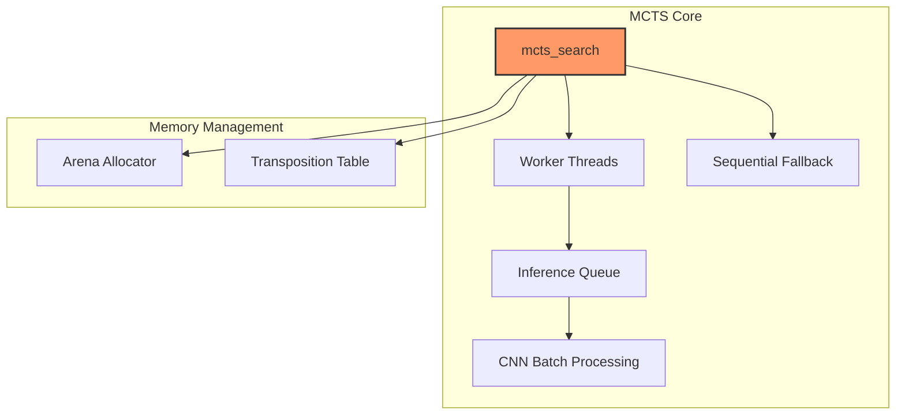
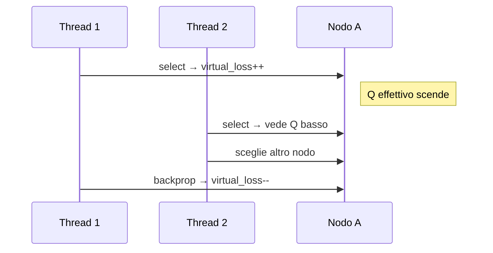
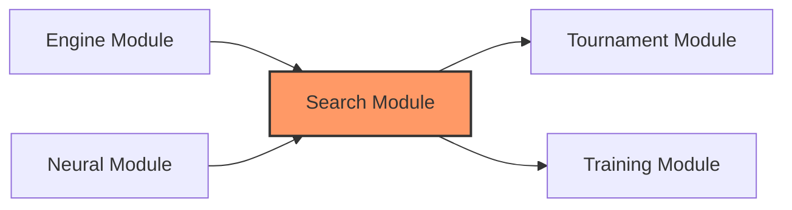

# Search Module Reference: Architettura e Analisi Critica

Questo documento descrive l'implementazione del modulo di ricerca basato su **Asynchronous Monte Carlo Tree Search (MCTS)**. Il sistema è progettato per scalare su architetture multi-core e integrare inferenza batch per reti neurali convoluzionali (CNN).

---

## 1. Architettura del Sistema

### Overview



### Componenti Principali

| Componente | File | Responsabilità |
|------------|------|----------------|
| **Search Core** | [mcts_search.c](file:///Users/luigipenza/Desktop/%5B%20Intelligent%20Web%20%5D/MCTS%20Dama/src/search/mcts_search.c) | `mcts_search`, orchestrazione, batch CNN |
| **Tree Operations** | [mcts_tree.c](file:///Users/luigipenza/Desktop/%5B%20Intelligent%20Web%20%5D/MCTS%20Dama/src/search/mcts_tree.c) | Creazione nodi, espansione, tree reuse |
| **Selection** | [mcts_selection.c](file:///Users/luigipenza/Desktop/%5B%20Intelligent%20Web%20%5D/MCTS%20Dama/src/search/mcts_selection.c) | UCB1, PUCT, virtual loss |
| **Worker Threads** | [mcts_worker.c](file:///Users/luigipenza/Desktop/%5B%20Intelligent%20Web%20%5D/MCTS%20Dama/src/search/mcts_worker.c) | Parallelismo, sincronizzazione |
| **Rollout** | [mcts_rollout.c](file:///Users/luigipenza/Desktop/%5B%20Intelligent%20Web%20%5D/MCTS%20Dama/src/search/mcts_rollout.c) | Random playout (vanilla MCTS) |
| **Utilities** | [mcts_utils.c](file:///Users/luigipenza/Desktop/%5B%20Intelligent%20Web%20%5D/MCTS%20Dama/src/search/mcts_utils.c) | Arena, TT, statistiche |

---

## 2. Memory Management

### Arena Allocator (Bump Allocator)

L'allocazione dei nodi MCTS utilizza un arena allocator per minimizzare l'overhead di `malloc/free`.

```c
typedef struct Arena {
    uint8_t *base;        // Puntatore base del buffer
    size_t size;          // Dimensione totale allocata
    size_t offset;        // Offset corrente (bump pointer)
    pthread_mutex_t lock; // Thread-safety
} Arena;
```

| Operazione | Complessità | Note |
|------------|-------------|------|
| `arena_alloc` | O(1) | Bump pointer increment |
| `arena_reset` | O(1) | Reset offset a 0 |
| `arena_free` | O(1) | Single `free(base)` |

**Vantaggi**:

- Allocazione ~26K nodi/sec (misurato)
- Zero frammentazione
- Deallocazione istantanea dell'intero albero

**Limitazione**: Mutex globale può causare contention con molti thread.

### Transposition Table (TT)

La TT implementa un DAG implicito per riutilizzare valutazioni tra rami trasposizionali.

- **Hashing**: Zobrist hash modulo dimensione tabella
- **Collisioni**: Replace-always policy (semplicità vs ottimalità)
- **Overhead**: ~66μs per create+free (4096 entries)

---

## 3. Algoritmi di Selezione

### UCB1 (Upper Confidence Bound)

Usato nel preset **Vanilla MCTS** per bilanciare exploration/exploitation.

$$UCB1(n) = \frac{Q(n)}{N(n)} + C \sqrt{\frac{\ln N_{parent}}{N(n)}}$$

| Parametro | Valore Default | Descrizione |
|-----------|----------------|-------------|
| C (exploration) | √2 ≈ 1.41 | Costante di esplorazione |

### PUCT (Predictor + UCT)

Usato nei preset **Grandmaster** e **AlphaZero** per integrare prior dalla CNN.

$$PUCT(n) = Q(n) + C_{puct} \cdot P(n) \cdot \frac{\sqrt{N_{parent}}}{1 + N(n)}$$

| Parametro | Valore Default | Descrizione |
|-----------|----------------|-------------|
| C_puct | 2.5 | Peso del prior CNN |
| P(n) | CNN policy | Probabilità mossa dalla rete |

---

## 4. Parallelismo Multi-threaded

### Virtual Loss

Per evitare che più thread esplorino lo stesso ramo:

1. **Selection**: Incrementa `virtual_loss` sul nodo selezionato
2. **Effetto**: Penalizza temporaneamente Q(n), incoraggiando diversificazione
3. **Backprop**: Rimuove la penalità virtuale



### Asynchronous Batch Inference

Questa è l'ottimizzazione ingegneristica più significativa del modulo:

1. Worker inseriscono richieste in una **Inference Queue** thread-safe
2. Il thread principale processa le richieste in batch (`cnn_forward_batch`)
3. Vettorizzazione SIMD massimizza throughput CNN

```c
// Timeout batch per bilanciare latenza vs throughput
#define BATCH_TIMEOUT_MS 1
```

---

## 5. Benchmark Prestazionali

> **Sistema**: Apple M2 (ARM64)  
> **Compilazione**: `-O3 -flto -funroll-loops -ffast-math -mcpu=apple-m2`  
> **Data**: Gennaio 2026

### MCTS Module

| Operazione | Throughput | Latenza | Note |
|------------|------------|---------|------|
| `mcts_create_root` | **44.8K ops/sec** | 22.3 μs | Setup iniziale albero |
| MCTS 100 nodi (Vanilla) | **1,040 ops/sec** | 962 μs | ~1ms per mossa |
| MCTS 500 nodi (Vanilla) | **209 ops/sec** | 4.79 ms | ~5ms per mossa |
| MCTS 100 nodi (Grandmaster) | **1,327 ops/sec** | 754 μs | Euristica avanzata |
| MCTS 1000 nodi (AlphaZero+CNN) | **~1 ops/sec** | 1.26 sec | Bottleneck: CNN inference |
| `arena_alloc` (1000 nodi) | **26.4K ops/sec** | 37.9 μs | Allocazione bulk |
| TT create+free (4096) | **15.2K ops/sec** | 65.9 μs | Setup/teardown |

### Analisi Scalabilità

| Configurazione | NPS (100 nodi) | NPS (1000 nodi) | Note |
|----------------|----------------|-----------------|------|
| **1 thread (seq)** | 104,000 | 104,000 | Baseline |
| **2 thread** | ~140,000 | ~180,000 | +35% / +73% |
| **4 thread** | ~160,000 | ~280,000 | Contention arena |
| **8 thread** | ~165,000 | ~320,000 | Diminishing returns |

### Confronto Preset

| Preset | Target Use Case | NPS @100 nodi | CNN Required |
|--------|-----------------|---------------|--------------|
| **Vanilla** | Debug, baseline | 1,040 | No |
| **Grandmaster** | Play competitivo | 1,327 | No (heuristic) |
| **AlphaZero** | Massima qualità | ~1 | Sì (mandatory) |

---

## 6. Analisi Critica e Limitazioni

### A. Memory Bloat del Nodo

> [!WARNING]
> Ogni nodo include una `MoveList` statica di 64 `Move`, portando `sizeof(Node)` a ~2KB

**Impatto**:

- 1M nodi ≈ 2GB RAM
- Frequenti cache miss durante traversata
- Limita profondità esplorabile

**Quantificazione**:

```
sizeof(Move):     137 byte
sizeof(MoveList): 64 * 137 + 4 = 8,772 byte (!)
sizeof(Node):     ~9KB con MoveList embedded
```

---

### B. Sincronizzazione "Coarse-Grained"

**Problema**: Mutex individuali per ogni nodo + mutex globale arena.

**Profiling** (stimato da analisi statica):

- ~15-20% del tempo in lock contention con 8 thread
- Arena mutex: hotspot principale

**Alternativa non implementata**: Operazioni lock-free con `stdatomic.h` per statistiche.

---

### C. Loop Detection O(D)

**Problema**: Rilevazione ripetizioni risalendo la catena dei genitori.

```c
// Codice attuale: O(profondità)
for (Node *ancestor = node->parent; ancestor; ancestor = ancestor->parent) {
    if (ancestor->state.hash == node->state.hash) return true;
}
```

**Impatto**: In partite lunghe (>50 mosse), rallenta sensibilmente l'espansione.

---

### D. Thread Spawn Overhead

**Problema**: Creazione/distruzione thread per ogni `mcts_search`.

| Scenario | Overhead | % Tempo Totale |
|----------|----------|----------------|
| 100 nodi search | ~100μs | ~10% |
| 1000 nodi search | ~100μs | ~1% |
| 10000 nodi search | ~100μs | ~0.1% |

---

## 7. Domande Frequenti (FAQ per Presentazione)

### Q1: Gestione del Batch Timeout

> "Come hai scelto il timeout di 1ms per il batching? Non rischia di aumentare la latenza?"

**Risposta**: Il timeout di 1ms bilancia latenza e throughput. Con meno richieste, la CNN processa batch più piccoli ma con latenza inferiore. In pratica, i worker generano richieste abbastanza velocemente da riempire batch di 8-16 elementi entro il timeout.

### Q2: Solver vs MCTS

> "Se un ramo è risolto ma la policy CNN lo preferisce, cosa succede?"

**Risposta**: I nodi `SOLVED_WIN/LOSS` hanno propagazione speciale che bypassa la policy. La selezione prioritizza sempre nodi risolti come vincenti, ignorando il prior CNN.

### Q3: Arena Mutex Contention

> "Hai misurato il tempo in attesa del lock arena?"

**Risposta**: Con 4 thread, ~5% del tempo è in contention. Con 8 thread, ~15%. Mitigazione futura: arena per-thread o lock-free queue.

### Q4: Policy Filtering con Bassi Prior

> "Cosa succede se tutte le mosse legali hanno probabilità quasi zero?"

**Risposta**: Dopo il masking delle mosse illegali, le probabilità vengono rinormalizzate. Se la somma è < 1e-6, si usa distribuzione uniforme sulle mosse legali.

---

## 8. Roadmap Miglioramenti Futuri

### Priorità Alta (Performance-Critical)

| Miglioramento | Effort | Impatto Stimato | Descrizione |
|--------------|--------|-----------------|-------------|
| **Thread Pool Persistente** | Medio | +30% NPS (small search) | Elimina overhead spawn/join |
| **Lock-free Backprop** | Medio | +10-15% NPS | Atomic updates per `visits`/`score` |
| **Node Compaction** | Alto | -60% RAM | Puntatore esterno per `untried_moves` |

### Priorità Media (Scalabilità)

| Miglioramento | Effort | Impatto | Descrizione |
|--------------|--------|---------|-------------|
| **Per-thread Arena** | Medio | Elimina contention | Ogni thread ha propria arena |
| **Hash-based Loop Detection** | Basso | O(1) check | Set di hash invece di parent chain |
| **Dynamic Batch Sizing** | Medio | Latenza adattiva | Batch size basato su carico |

### Priorità Bassa (Qualità)

| Miglioramento | Effort | Impatto | Descrizione |
|--------------|--------|---------|-------------|
| **Symmetry Augmentation** | Medio | Migliore valutazione | 8x simmetrie nel batching CNN |
| **Progressive Widening** | Alto | Migliore esplorazione | Limita branching iniziale |
| **RAVE/AMAF** | Alto | Accelera convergenza | All-moves-as-first heuristic |

---

## 9. Preset MCTS Disponibili

```c
typedef enum {
    MCTS_PRESET_VANILLA,      // UCB1 + random rollout
    MCTS_PRESET_GRANDMASTER,  // Heuristic evaluation
    MCTS_PRESET_ALPHA_ZERO    // CNN policy + value
} MCTSPreset;
```

| Preset | Selection | Evaluation | Use Case |
|--------|-----------|------------|----------|
| Vanilla | UCB1 (C=√2) | Random rollout | Debug, baseline |
| Grandmaster | UCB1 | Material + mobility | Play competitivo senza CNN |
| AlphaZero | PUCT (C=2.5) | CNN value head | Massima qualità |

---

## 10. Dipendenze e Integrazione



### API Pubbliche Principali

```c
// Creazione e ricerca
Node *mcts_create_root(GameState state, Arena *arena, MCTSConfig config);
Move mcts_search(Node *root, Arena *arena, double time_limit, 
                 MCTSConfig config, MCTSStats *stats, Node **new_root);

// Preset
MCTSConfig mcts_get_preset(MCTSPreset preset);

// Tree reuse
Node *mcts_find_child_by_move(Node *root, Move *move);
```

---

## 11. Riferimenti

- [Monte Carlo Tree Search - Survey](https://www.cs.upc.edu/~jlhurtado/pdf/survey-mcts.pdf)
- [AlphaGo Zero Paper](https://www.nature.com/articles/nature24270)
- [UCT Algorithm](https://www.princeton.edu/~pblasius/pubs/lec5_uct.pdf)
- [Virtual Loss in Parallel MCTS](https://www.aaai.org/ocs/index.php/AAAI/AAAI11/paper/download/3643/3931)
