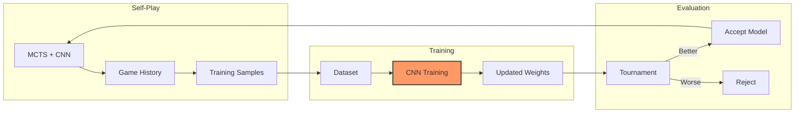
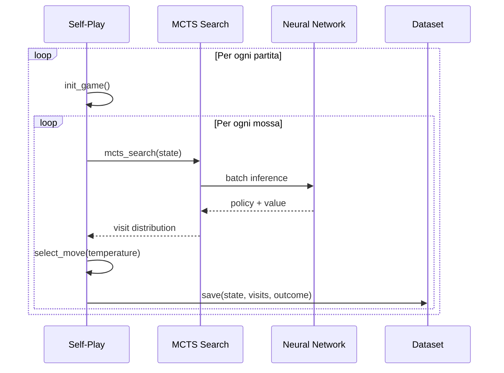
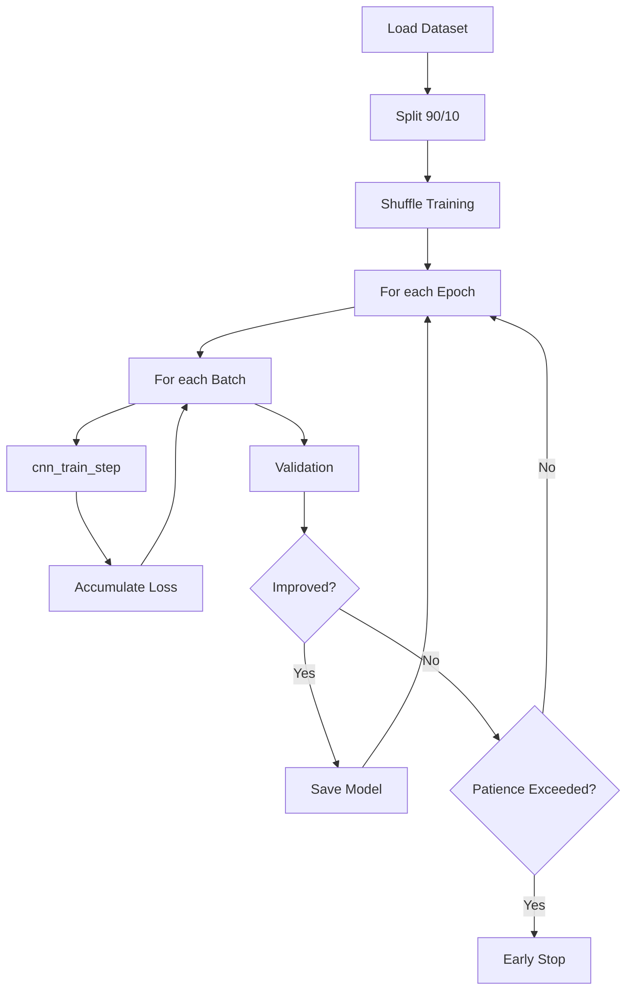
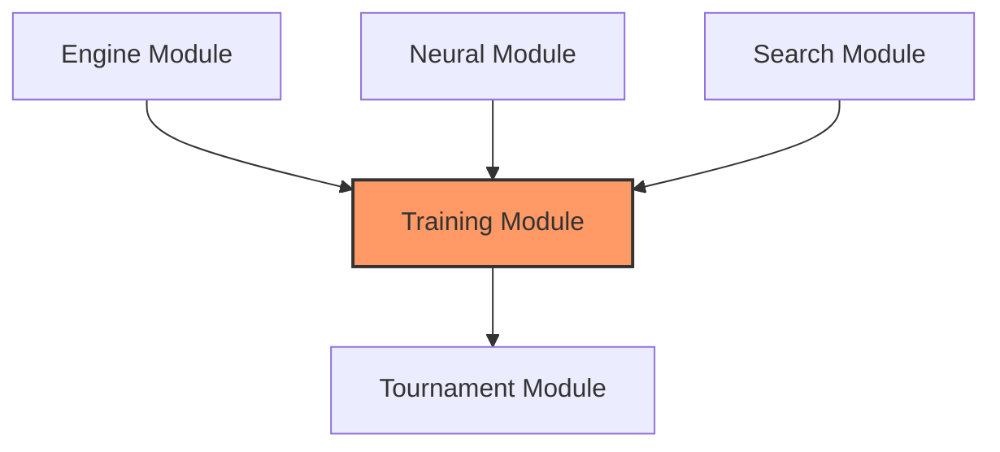

# Training Module Reference: Architettura e Analisi Critica

Questo documento descrive il modulo di training per l'approccio AlphaZero alla Dama Italiana. Il sistema implementa un ciclo completo: self-play → dataset → training → evaluation, seguendo il paradigma di apprendimento per rinforzo con supervisione.

---

## 1. Architettura del Sistema

### Pipeline AlphaZero



### Componenti Principali

| Componente | File | Responsabilità |
|------------|------|----------------|
| **Self-Play** | [selfplay.c](file:///Users/luigipenza/Desktop/%5B%20Intelligent%20Web%20%5D/MCTS%20Dama/src/training/selfplay.c) | Generazione partite, Dirichlet noise, temperature annealing |
| **Training Pipeline** | [training_pipeline.c](file:///Users/luigipenza/Desktop/%5B%20Intelligent%20Web%20%5D/MCTS%20Dama/src/training/training_pipeline.c) | Loop di training, validation, early stopping |
| **CNN Training** | [cnn_training.c](file:///Users/luigipenza/Desktop/%5B%20Intelligent%20Web%20%5D/MCTS%20Dama/src/training/cnn_training.c) | Backpropagation, SGD con momentum |
| **Dataset** | [dataset.c](file:///Users/luigipenza/Desktop/%5B%20Intelligent%20Web%20%5D/MCTS%20Dama/src/training/dataset.c) | Save/load binario, shuffle, split |
| **Dataset Analysis** | [dataset_analysis.c](file:///Users/luigipenza/Desktop/%5B%20Intelligent%20Web%20%5D/MCTS%20Dama/src/training/dataset_analysis.c) | Statistiche, distribuzione valori |
| **Endgame** | [endgame.c](file:///Users/luigipenza/Desktop/%5B%20Intelligent%20Web%20%5D/MCTS%20Dama/src/training/endgame.c) | Setup posizioni endgame random |

---

## 2. Self-Play

### Algoritmo



### Parametri Chiave

| Parametro | Valore Default | Descrizione |
|-----------|----------------|-------------|
| `MCTS_SIMS_PER_MOVE` | 800 | Simulazioni MCTS per mossa |
| `DIRICHLET_ALPHA` | 0.3 | Rumore per esplorazione root |
| `DIRICHLET_EPSILON` | 0.25 | Peso del rumore (25%) |
| `TEMP_THRESHOLD` | 30 | Mosse prima di temperature → 0 |
| `ENDGAME_PROB` | 0.2 | Probabilità inizio da endgame |

### Temperature Annealing

```c
// Strategia temperatura (selfplay.c)
if (move_number < TEMP_THRESHOLD) {
    temp = initial_temp;  // 1.0 - esplorazione
} else {
    temp = 0.0;           // Greedy - sfruttamento
}
```

### Dirichlet Noise

Per evitare loop nella policy, rumore Dirichlet alla root:

$$P'(a) = (1 - \epsilon) \cdot P(a) + \epsilon \cdot \text{Dir}(\alpha)$$

```c
void add_dirichlet_noise(Node *root, RNG *rng, float eps, float alpha);
```

---

## 3. Training Pipeline

### Configurazione

```c
typedef struct {
    const char *data_path;       // Path dataset
    const char *model_path;      // Path output model
    const char *backup_path;     // Path backup (optional)
    int epochs;                  // Max epoche (default: 100)
    int batch_size;              // Batch size (default: 64)
    float learning_rate;         // LR iniziale (default: 0.001)
    float l2_decay;              // Weight decay (default: 0.0001)
    int patience;                // Early stopping patience
    int num_threads;             // OpenMP threads
    
    // Callbacks
    void (*on_init)(int n_train, int n_val);
    void (*on_epoch_start)(int epoch, int total, float lr);
    void (*on_batch_log)(int b, int total, float p_loss, float v_loss, int seen);
    void (*on_epoch_end)(int epoch, float train_p, float train_v, 
                        float val_p, float val_v, float acc, int improved, const char *path);
    void (*on_complete)(float best_loss, int best_epoch);
} TrainingPipelineConfig;
```

### Training Loop



### Learning Rate Schedule

| Feature | Valore | Descrizione |
|---------|--------|-------------|
| **Warmup** | 1 epoca | LR lineare 0 → target |
| **Decay Factor** | 0.5 | Riduzione dopo plateau |
| **Decay Patience** | 5 epoche | Epoche senza improvement |
| **Min LR** | 1e-6 | Floor per learning rate |

```c
// LR separati per policy e value heads
float policy_lr = base_lr;
float value_lr = base_lr * (CNN_VALUE_LR / CNN_POLICY_LR);
```

---

## 4. Dataset Format

### Struttura File Binario

```
┌────────────────────────────────────┐
│ Header (12 bytes)                  │
│  - Magic: "DAMA" (4 bytes)         │
│  - Version: uint32_t               │
│  - Sample Count: uint32_t          │
├────────────────────────────────────┤
│ Samples (N × sizeof(TrainingSample))│
│  - GameState state                 │
│  - GameState history[2]            │
│  - float target_policy[256]        │
│  - float target_value              │
└────────────────────────────────────┘
```

### TrainingSample Structure

```c
typedef struct {
    GameState state;                        // Current position
    GameState history[CNN_HISTORY_T - 1];   // T=-1, T=-2
    float target_policy[CNN_POLICY_SIZE];   // Visit distribution (normalized)
    float target_value;                     // Game outcome [-1, 0, +1]
} TrainingSample;
```

**Dimensione**: ~1.2 KB per sample

---

## 5. Benchmark Prestazionali

> **Sistema**: Apple M2 (ARM64)  
> **Compilazione**: `-O3 -flto -funroll-loops -ffast-math -mcpu=apple-m2`  
> **Data**: Gennaio 2026

### Training Performance

| Operazione | Throughput | Latenza | Note |
|------------|------------|---------|------|
| `cnn_train_step` (batch=1) | **46 steps/sec** | 21.9 ms | Include forward + backward |
| `cnn_train_step` (batch=32) | **19 batches/sec** | 53.4 ms | ~608 samples/sec |
| `dataset_shuffle` (1000) | **7,863 ops/sec** | 127 μs | Fisher-Yates |
| `dataset_load` (10K) | ~50/sec | ~20 ms | I/O bound |

### Self-Play Performance

| Operazione | Throughput | Note |
|------------|------------|------|
| Game (800 sims/move) | ~0.02 games/sec | ~50 sec/game |
| Game (100 sims/move) | ~0.2 games/sec | ~5 sec/game (fast) |
| Sample generation | ~40-60 samples/game | Dipende da lunghezza partita |

### Training Throughput Tipico

| Fase | Velocità | Note |
|------|----------|------|
| Self-play (100 games) | ~80 min | 800 sims, endgame mix |
| Training (10K samples, 50 epochs) | ~15 min | Batch 64, early stop |
| Full iteration | ~2 ore | Self-play + train + eval |

---

## 6. Analisi Critica e Limitazioni

### A. Self-Play Lento (CPU-Only)

> [!WARNING]
> Senza GPU, la generazione dati è bottleneck principale

**Problema**: 800 sims/move con CNN è ~1 mossa al secondo.

**Impatto**:

- 1 partita ≈ 50 secondi
- 1000 partite ≈ 14 ore
- Ciclo training completo: giorni

**Mitigazione attuale**: Modalità "fast" con 100 sims per iterazioni iniziali.

**Perché non GPU/ANE?** L'accelerazione hardware su macOS richiede:

- **Metal**: API grafica Apple, accessibile da C solo tramite wrapper Objective-C
- **CoreML**: Framework ML ottimizzato per ANE, richiede modelli in formato `.mlmodel` e binding Swift/Objective-C
- **MPS (Metal Performance Shaders)**: Operazioni CNN accelerate, ma API Objective-C

Il refactoring per supportare questi backend richiederebbe un layer di interoperabilità C ↔ Objective-C significativo, aggiungendo complessità al progetto.

---

### B. No Data Augmentation

**Problema**: La Dama Italiana **non è simmetrica**.

**Spiegazione**:

- A differenza degli scacchi, la dama ha asimmetria strutturale: le pedine si muovono solo in avanti, e le direzioni di movimento dipendono dal colore
- L'encoding della rete è **canonico**: la scacchiera viene sempre vista dal punto di vista del giocatore corrente (flip verticale per il Nero)
- Un'augmentazione orizzontale (mirror sinistra-destra) creerebbe posizioni illegali (le caselle giocabili sono solo quelle scure)
- Un'augmentazione verticale non ha senso perché la rete già normalizza la vista per ogni giocatore

**Conseguenza**: Non è possibile applicare data augmentation tradizionale come in altri domini (computer vision, scacchi).

---

### C. Target Value Binario

**Problema**: `target_value` è {-1, 0, +1} (outcome finale).

**Limitazione**:

- Nessuna informazione sulla "distanza" dalla vittoria
- Errori in posizioni patte valutate come vittoria

**Alternativa**: Q-value bootstrapping o TD(λ).

---

### D. No Replay Buffer

**Problema**: Training usa solo dati dell'ultima iterazione self-play.

**Conseguenza**:

- Rischio "catastrophic forgetting"
- Modello dimentica posizioni vecchie

**Soluzione standard (non implementata)**: Replay buffer con sampling prioritizzato.

---

## 7. Workflow Tipico

### Iterazione Training Completa

```bash
# 1. Self-Play
./bin/dama selfplay -n 100 -s 800 -o data/iter_001.dat --weights model.bin

# 2. Training
./bin/dama train -d data/iter_001.dat -e 50 -b 64 -o model_new.bin

# 3. Evaluation (Tournament)
./bin/dama tournament -p1 model_new.bin -p2 model.bin -g 100

# 4. Se model_new vince >55%: replace model.bin
```

### Comandi CLI Disponibili

| Comando | Descrizione |
|---------|-------------|
| `dama selfplay` | Genera partite self-play |
| `dama train` | Training CNN su dataset |
| `dama tournament` | Evaluation head-to-head |
| `dama data-info` | Statistiche dataset |

---

## 8. Roadmap Miglioramenti Futuri

### Priorità Alta (Training Quality)

| Miglioramento | Effort | Impatto Stimato | Descrizione |
|--------------|--------|-----------------|-------------|
| **Replay Buffer** | Medio | +20% stabilità | Mantieni ultimi 500K samples |
| **TD(λ) Targets** | Alto | +10% value accuracy | Bootstrap invece di outcome |
| **GPU/ANE Backend** | Molto Alto | +10-50x throughput | Metal/CoreML per inference accelerata |

### Priorità Media (Performance)

| Miglioramento | Effort | Impatto | Descrizione |
|--------------|--------|---------|-------------|
| **Parallel Self-Play** | Medio | 4-8x throughput | Multi-thread game generation |
| **Mixed Precision Training** | Medio | +30% throughput | FP16 backward pass |
| **Async Data Loading** | Basso | Overlap I/O | Background loading mentre train |

### Priorità Bassa (Advanced)

| Miglioramento | Effort | Impatto | Descrizione |
|--------------|--------|---------|-------------|
| **Population Based Training** | Molto Alto | Auto-tune hyperparams | Evoluzione parallela |
| **Curriculum Learning** | Alto | Faster convergence | Da semplice a complesso |
| **Meta-Learning** | Molto Alto | Transfer learning | Pre-train su giochi simili |

---

## 9. Hyperparameters Reference

### Training Defaults (params.h)

| Parametro | Valore | Note |
|-----------|--------|------|
| `CNN_POLICY_LR` | 0.001 | Learning rate policy head |
| `CNN_VALUE_LR` | 0.01 | Learning rate value head (10x) |
| `CNN_LR_WARMUP_EPOCHS` | 1 | Epoche warmup |
| `CNN_LR_DECAY_FACTOR` | 0.5 | Fattore decay plateau |
| `CNN_LR_DECAY_PATIENCE` | 5 | Epoche prima decay |
| `CNN_BATCH_SIZE` | 64 | Batch size default |

### Self-Play Defaults

| Parametro | Valore | Note |
|-----------|--------|------|
| `MCTS_SIMS_PER_MOVE` | 800 | Simulazioni per mossa |
| `INITIAL_TEMP` | 1.0 | Temperatura iniziale |
| `TEMP_THRESHOLD` | 30 | Mosse prima di temp=0 |
| `DIRICHLET_ALPHA` | 0.3 | Concentrazione rumore |
| `DIRICHLET_EPSILON` | 0.25 | Peso rumore (25%) |

---

## 10. API Principali

### Self-Play

```c
typedef struct {
    int num_games;           // Partite da generare
    int mcts_sims;           // Simulazioni per mossa
    const char *output_path; // Output dataset
    float initial_temp;      // Temperatura iniziale
    float endgame_prob;      // Prob. inizio endgame
} SelfplayConfig;

void selfplay_run(const SelfplayConfig *sp_cfg, const MCTSConfig *mcts_cfg);
```

### Training

```c
void training_run(CNNWeights *weights, const TrainingPipelineConfig *cfg);
```

### Dataset

```c
int dataset_save(const char *filename, const TrainingSample *samples, size_t count);
int dataset_load(const char *filename, TrainingSample *samples, size_t max_samples);
int dataset_get_count(const char *filename);
void dataset_shuffle(TrainingSample *samples, size_t count);
```

---

## 11. Dipendenze



---

## 12. Riferimenti

- [AlphaGo Zero Paper - Methods](https://www.nature.com/articles/nature24270)
- [Mastering Chess with Self-Play](https://arxiv.org/abs/1712.01815)
- [Dirichlet Distribution in MCTS](https://medium.com/@jonathan_hui/alphago-how-it-works-aa6a2ca1d66e)
- [Learning Rate Warmup](https://arxiv.org/abs/1706.02677)
